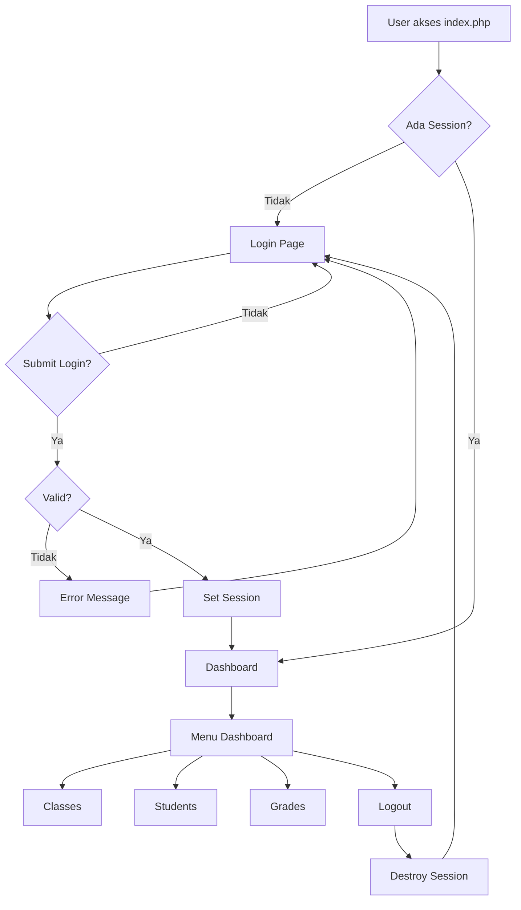
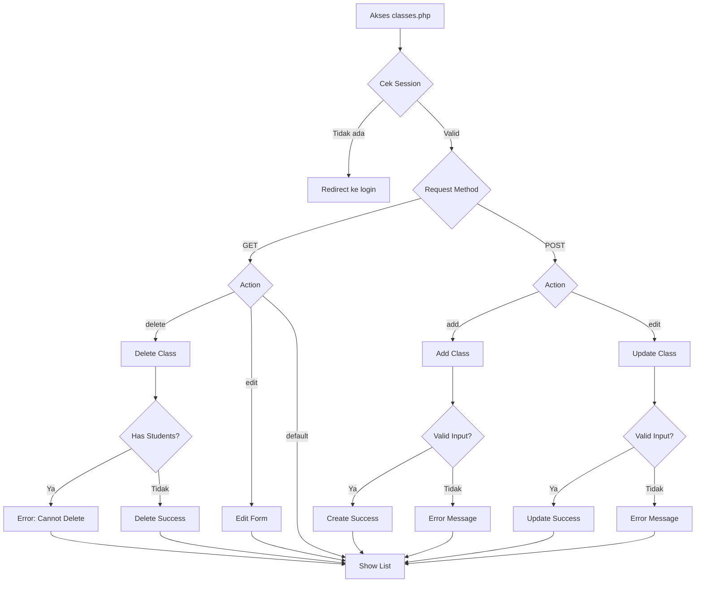
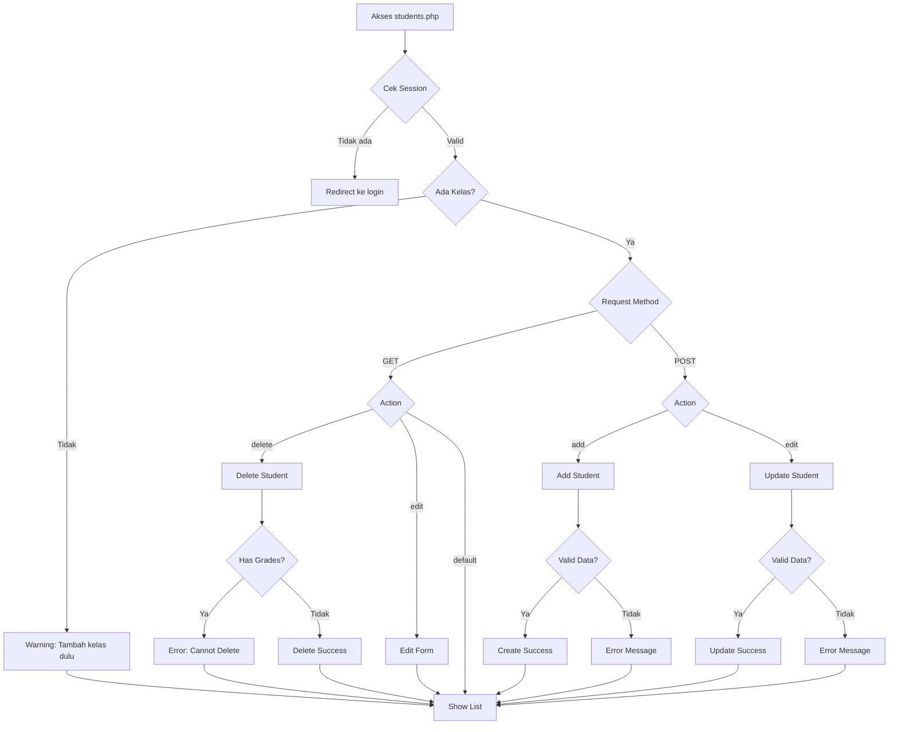
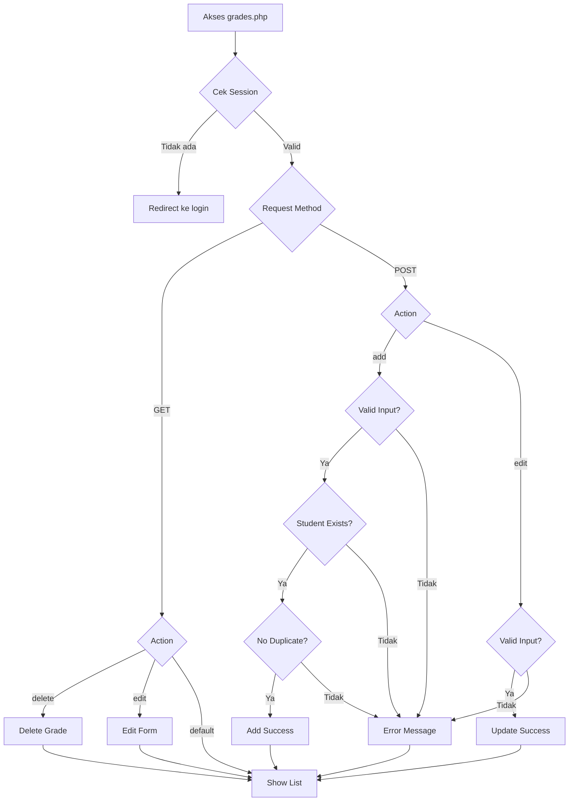
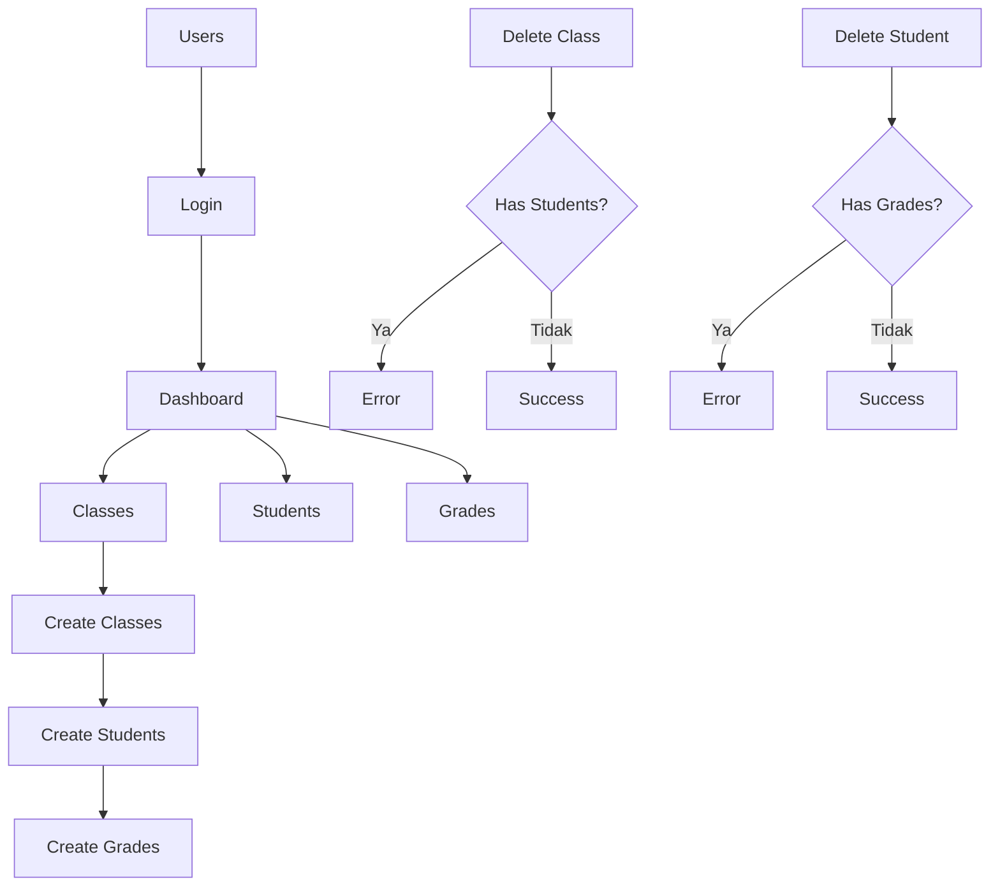

Berdasarkan arsitektur aplikasi Student Grade Management, berikut adalah file Mermaid untuk alur poin 1-3:

## 1. Alur Autentikasi & Routing Utama



## 2. Alur Manajemen Kelas (classes.php)



## 3. Alur Manajemen Siswa (students.php)




## 3A. Alur Menambahkan Nilai (grades.php)


```


## 4. Dependensi Antar Modul


