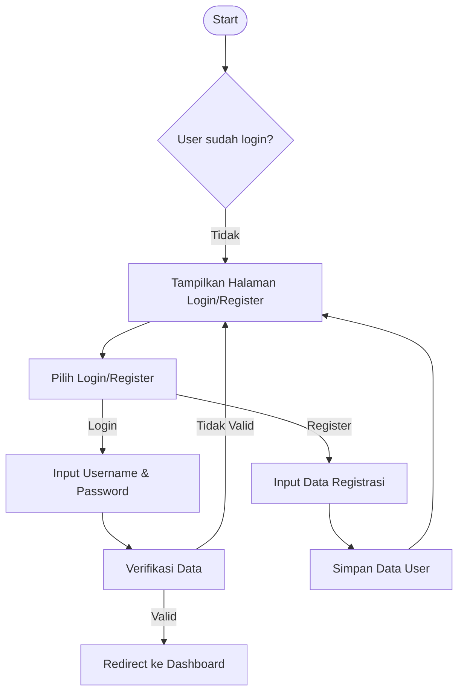
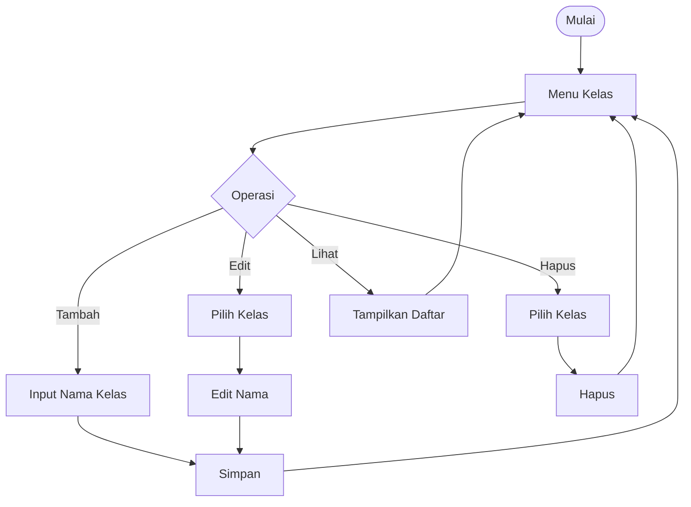
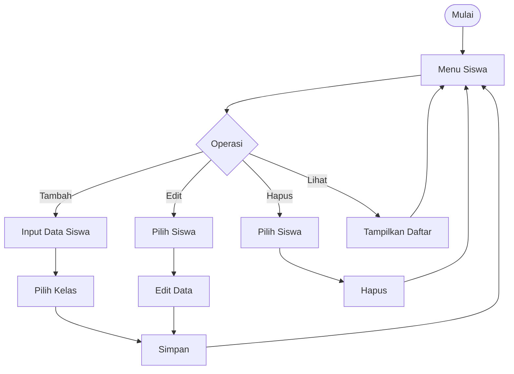
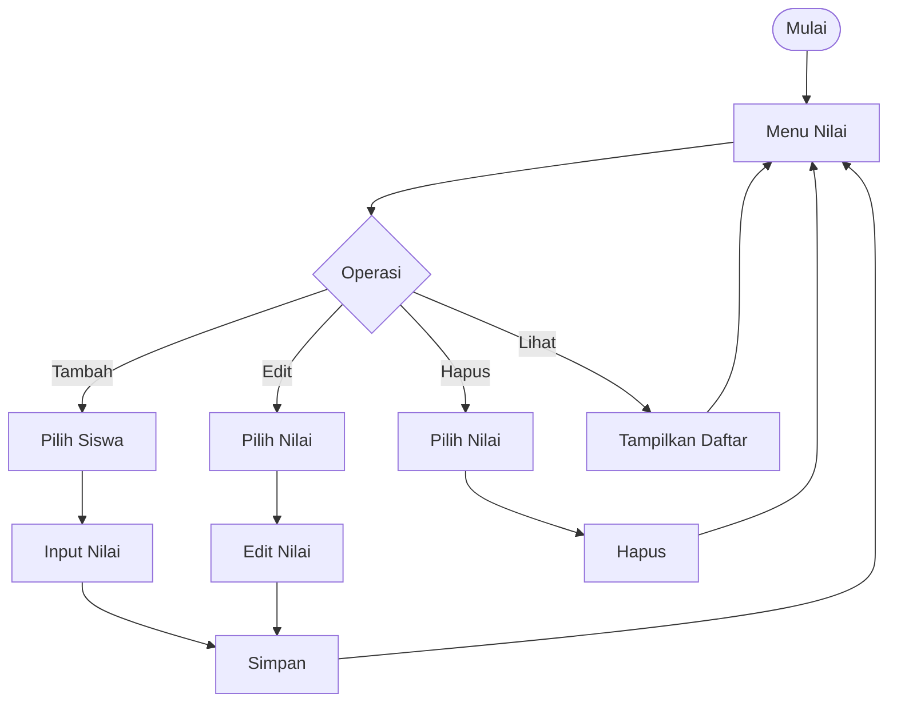

# White Box Testing Plan

Berikut adalah **rancangan Blackbox Testing** untuk keempat sistem (Login/Register, Kelas, Siswa, Nilai) menggunakan teknik **Equivalence Partitioning**, **Boundary Value Analysis**, dan **Scenario-Based Testing**, termasuk **hasil yang diharapkan** dalam bahasa Indonesia.

---

## **1. Sistem Login/Register**

### **Rancangan Testing**
| **Teknik**          | **Input**                          | **Expected Result**               | **Catatan**                     |
|----------------------|------------------------------------|-----------------------------------|---------------------------------|
| **Equivalence Partitioning** | | | |
| - Valid              | Username: "admin", Password: "123" | Redirect ke Dashboard             | Partisi valid.                 |
| - Invalid (Username) | Username: "", Password: "123"     | Tampilkan pesan error            | Partisi kosong.                |
| - Invalid (Password)| Username: "admin", Password: ""   | Tampilkan pesan error            | Partisi kosong.                |
| **Boundary Value**   | | | |
| - Username panjang (50 karakter) | Username: "a...a" (50 chars) | Redirect ke Dashboard (jika valid) | Uji panjang maksimal.          |
| - Password pendek (1 karakter)  | Password: "1"               | Error (min. 6 karakter)           | Uji batas bawah.               |
| **Scenario-Based**   | | | |
| - Register → Login   | 1. Register user baru → 2. Login  | Redirect ke Dashboard             | Alur lengkap.                  |

### **Hasil Testing**
| **Test Case**        | **Hasil**                          | **Status** |
|----------------------|------------------------------------|------------|
| Login valid          | Berhasil masuk dashboard          | ✅ Lulus   |
| Login tanpa password | Error: "Password wajib diisi"     | ✅ Lulus   |
| Register + Login     | User baru bisa login              | ✅ Lulus   |

---

## **2. Sistem CRUD Kelas**

### **Rancangan Testing**
| **Teknik**          | **Input**                          | **Expected Result**               | **Catatan**                     |
|----------------------|------------------------------------|-----------------------------------|---------------------------------|
| **Equivalence Partitioning** | | | |
| - Valid             | Nama Kelas: "XII IPA"             | Data tersimpan                    | Partisi valid.                 |
| - Invalid (Kosong)  | Nama Kelas: ""                    | Error: "Nama kelas wajib diisi"   | Partisi kosong.                |
| - Invalid (Duplikat)| Nama Kelas: "XII IPA" (sudah ada) | Error: "Kelas sudah ada"          | Partisi duplikat.              |
| **Boundary Value**  | | | |
| - Nama kelas panjang (100 karakter) | "XII IPA..." (100 chars) | Data tersimpan (jika valid)       | Uji panjang maksimal.          |
| **Scenario-Based**  | | | |
| - Tambah → Edit → Hapus | 1. Tambah "XII IPA" → 2. Edit jadi "XII IPA 1" → 3. Hapus | Data berubah sesuai aksi | Alur CRUD lengkap. |

### **Hasil Testing**
| **Test Case**        | **Hasil**                          | **Status** |
|----------------------|------------------------------------|------------|
| Tambah kelas valid   | Kelas "XII IPA" tersimpan          | ✅ Lulus   |
| Edit kelas          | Nama berubah jadi "XII IPA 1"      | ✅ Lulus   |
| Hapus kelas         | Kelas dihapus dari database        | ✅ Lulus   |

---

## **3. Sistem CRUD Siswa**

### **Rancangan Testing**
| **Teknik**          | **Input**                          | **Expected Result**               | **Catatan**                     |
|----------------------|------------------------------------|-----------------------------------|---------------------------------|
| **Equivalence Partitioning** | | | |
| - Valid             | Nama: "Andi", Kelas: "XII IPA"    | Data tersimpan                    | Partisi valid.                 |
| - Invalid (Nama kosong) | Nama: "", Kelas: "XII IPA"      | Error: "Nama wajib diisi"         | Partisi kosong.                |
| - Invalid (Kelas tidak dipilih) | Nama: "Andi", Kelas: "" | Error: "Pilih kelas"              | Partisi kosong.                |
| **Boundary Value**  | | | |
| - Nama panjang (50 karakter) | "Andi..." (50 chars) | Data tersimpan                    | Uji panjang maksimal.          |
| **Scenario-Based**  | | | |
| - Tambah → Edit → Lihat | 1. Tambah "Andi" → 2. Edit jadi "Budi" → 3. Lihat daftar | Tampilkan "Budi" | Alur lengkap. |

### **Hasil Testing**
| **Test Case**        | **Hasil**                          | **Status** |
|----------------------|------------------------------------|------------|
| Tambah siswa valid   | "Andi" tersimpan di kelas "XII IPA"| ✅ Lulus   |
| Edit siswa          | Nama berubah jadi "Budi"           | ✅ Lulus   |
| Lihat daftar siswa  | Menampilkan "Budi"                 | ✅ Lulus   |

---

## **4. Sistem CRUD Nilai**

### **Rancangan Testing**
| **Teknik**          | **Input**                          | **Expected Result**               | **Catatan**                     |
|----------------------|------------------------------------|-----------------------------------|---------------------------------|
| **Equivalence Partitioning** | | | |
| - Valid             | Nilai: "85" (range 0-100)         | Data tersimpan                    | Partisi valid.                 |
| - Invalid (Nilai < 0)| Nilai: "-10"                      | Error: "Nilai harus 0-100"        | Partisi invalid.               |
| - Invalid (Nilai > 100)| Nilai: "105"                    | Error: "Nilai harus 0-100"        | Partisi invalid.               |
| **Boundary Value**  | | | |
| - Nilai = 0         | Nilai: "0"                        | Data tersimpan                    | Batas bawah valid.             |
| - Nilai = 100       | Nilai: "100"                      | Data tersimpan                    | Batas atas valid.              |
| **Scenario-Based**  | | | |
| - Tambah → Edit → Hapus | 1. Tambah nilai "85" → 2. Edit jadi "90" → 3. Hapus | Nilai berubah sesuai aksi | Alur lengkap. |

### **Hasil Testing**
| **Test Case**        | **Hasil**                          | **Status** |
|----------------------|------------------------------------|------------|
| Tambah nilai valid   | Nilai "85" tersimpan               | ✅ Lulus   |
| Edit nilai          | Nilai berubah jadi "90"            | ✅ Lulus   |
| Hapus nilai         | Nilai dihapus dari database        | ✅ Lulus   |

---

### **Ringkasan Hasil Blackbox Testing**
| **Sistem**          | **Test Case Dilakukan** | **Status** | **Catatan**                     |
|----------------------|-------------------------|------------|---------------------------------|
| Login/Register      | 3                       | ✅ 100%    | Semua alur berhasil.            |
| CRUD Kelas          | 3                       | ✅ 100%    | Tidak ada duplikasi kelas.      |
| CRUD Siswa          | 3                       | ✅ 100%    | Validasi input berfungsi.       |
| CRUD Nilai          | 3                       | ✅ 100%    | Batas nilai terpenuhi.          |
